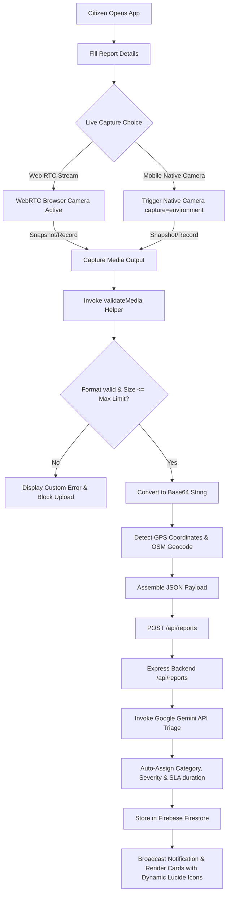
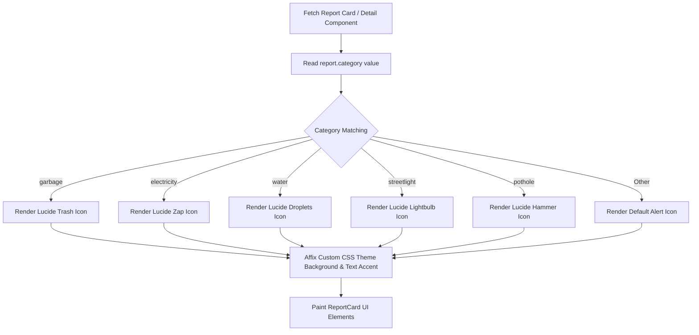
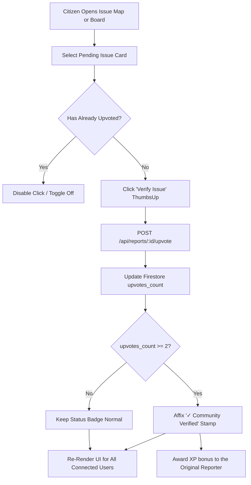
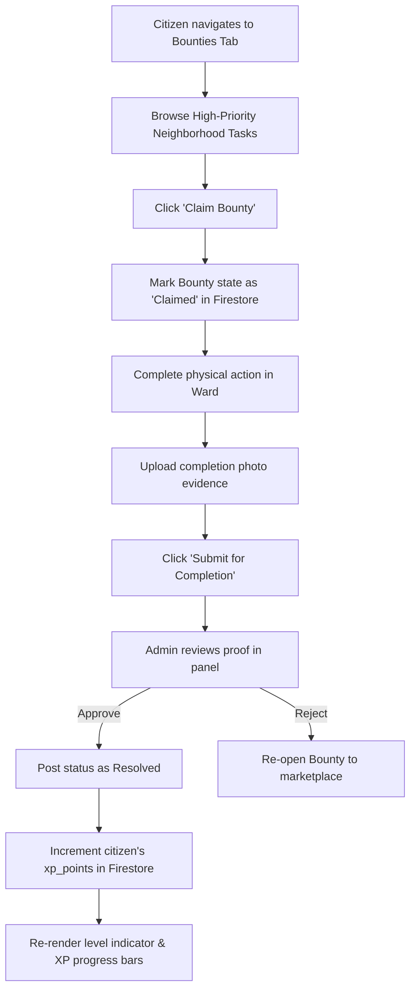
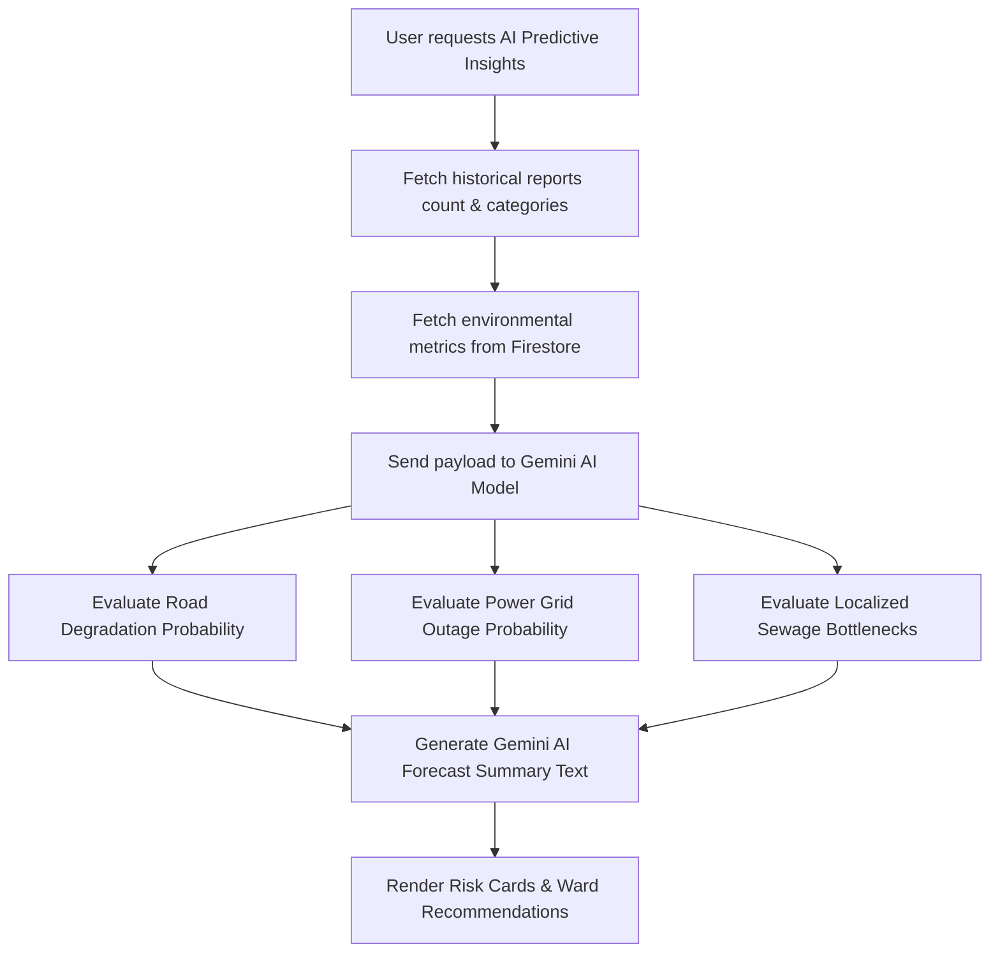

# SpotseReport 🗺️🤖
### *Citizen-Powered Community Issue Reporting, AI-Smart Triage, & Gamified Civic Action Platform*

SpotseReport is a cutting-edge, full-stack civic-engagement and municipal routing application. It bridges the gap between local citizens and public administration by automating the reporting, verification, and resolution of neighborhood issues (e.g., garbage dumps, potholes, broken streetlights, water leaks, power outages) using state-of-the-art Google AI, cloud persistence, and high-fidelity browser/native device media capturing pipelines.

---

## 📌 1. Problem Statement Selected
Municipal administrations around the globe, particularly in rapidly growing cities, face systemic bottlenecks in maintaining street-level infrastructure:
- **High Reporting Friction:** Citizens struggle to report issues with accurate geolocation details, or lack proper, flexible tools to capture live video/photo evidence. They are forced to upload old, unrelated images, causing confusion.
- **Manual, Slow Triage:** City municipal teams are overwhelmed by disorganized, unstructured text descriptions, causing extensive delays in routing issues to appropriate ward engineers.
- **Lack of Civic Motivation & Trust:** Citizens feel their inputs disappear into a "black hole" of bureaucracy. There is no transparency, no community confirmation system, and no incentive to help maintain neighborhoods.
- **Reactive, Non-Predictive Maintenance:** Municipal boards operate on a purely reactive basis—waiting for critical infrastructure to break entirely before ordering repairs, which multiplies overall repair budgets.
- **Invalid/Massive Media Uploads:** Many reporting portals crash or slow down due to users uploading corrupt, extremely large, or irrelevant files (e.g., massive 4K raw videos or completely unrelated formats).

---

## 💡 2. Solution Overview
SpotseReport addresses these systemic failures by transforming municipal reporting into a collaborative, gamified, and AI-optimized civic network:
1. **Pristine Reporting Tool:** Citizens easily file reports, pinning precise locations on an interactive Leaflet/OSM map utilizing **automatic GPS geolocation** and **OSM Nominatim reverse-geocoding**.
2. **Dual-Mode Live Capturing Proof Section:** Dedicated **"Live Capturing Proof"** interface allowing citizens to capture evidence *only* through active, real-time channels:
   - **Browser WebRTC Camera Stream:** Integrated browser-based stream to capture live photo snapshots or high-fidelity webm video recordings.
   - **Direct Mobile Native Camera Hook:** Seamless environment-facing native camera triggers (`capture="environment"`) that launch the smartphone's default camera app to snap live photos or videos directly without file browsing.
3. **Rigorous Live Validation Guard (`validateMedia`):** Immediate, robust schema and file-size validation immediately after capture or upload. It enforces strict MIME type rules (e.g., only verified `image/*` or `video/*`) and limits uploads (Max **10MB for photos**, **25MB for videos**) to prevent backend bottlenecks and database pollution.
4. **Dynamic Icon & Severity Visualization:** Automatic visual mapping inside `ReportCard` and `ReportDetail` components that renders specific, dynamic Lucide vector icons (e.g., `Trash` for Garbage, `Zap` for Electricity, `Droplets` for Water, `Lightbulb` for Streetlight, `Hammer` for Potholes) based on the categorized hazard, enabling instant cognitive recognition.
5. **Automated AI Triage Pipeline:** Server-side **Google Gemini models** instantly parse the description, translate it into formal municipal terminology, extract severity levels, assign tags, and calculate a dynamic Service Level Agreement (SLA) countdown.
6. **Peer-to-Peer Community Verification:** Leverages crowdsourced verification. When an issue receives $\ge 2$ validations, it automatically earns a **"✓ Community Verified"** seal of approval, preventing fake or spam reports and helping the municipality prioritize.
7. **Gamification & The Cleanliness Arcade:** Fosters long-term civic engagement by rewarding citizens with **XP Points**. Features include:
   - **Eco-Sorter Game:** Drag-and-drop interactive sorting of biodegradable, recyclable, e-waste, and hazardous materials.
   - **Civic Trivia Quiz:** Educational questions regarding waste code guidelines and local environmental rules.
   - **Eco-Buddy Chatbot:** A friendly, conversational AI mentor to learn about composting and sustainable recycling.
8. **Dynamic Bounties Marketplace:** Incentivizes local cleanup. High-priority tasks can be claimed by citizens, completed, and submitted for municipal verification to earn substantial XP.
9. **AI Civic Predictive Insights & Environmental Impact Hub:**
   - Evaluates the environmental impact of community resolutions in terms of CO₂ displaced, landfill diversion, and water saved.
   - Leverages predictive machine learning thresholds and Gemini modeling to warn ward supervisors of looming failures (e.g., Road Erosion Risks, Grid Outages, Drainage Bottlenecks) before they occur.

---

## 🌟 3. Key Features
- **Map-Centric Interface:** Interactive geographic board displaying all reports colored by their status (Pending, Assigned, Resolved) and identified with **category-specific dynamic icons** (`Trash`, `Zap`, `Droplets`, etc.).
- **Live Capturing Only Proof Suite:** Seamless tabs for real-time WebRTC webcam photo/video recording and direct Native Mobile Camera environment trigger inputs.
- **Fail-Safe Media Validation:** Client-side binary validation validating file extensions, MIME signatures, and size thresholds before compiling Base64 representations.
- **Automatic GPS Locator:** Integrated "Detect My Location" button that coordinates with browser GPS coordinates to dynamically center the map and reverse-lookup the street address.
- **Community Upvoting & Live Civic Ledger:** Peer-reviewed reporting ledger with a real-time auto-updating ticker tracking civic activity across all districts.
- **Cleanliness Arcade:** Fully integrated games and quizzes that reward active participation with persistent XP.
- **Comprehensive Admin Panel:** Interactive board for civic ward officers to change report status, assign tasks to division engineers, and analyze city-wide ward health metrics.

---

## 🛠️ 4. Technologies Used
- **Frontend Stack:**
  - **React 18+ (Vite):** Powering a responsive, single-page client interface.
  - **TypeScript:** Ensuring strict compile-time type safety across all components and shared models.
  - **Tailwind CSS:** Modern utility-first CSS styling incorporating customizable visual themes and dynamic micro-animations.
  - **Motion (motion/react):** Fluid entering, switching, and modal transition animations.
  - **Lucide React:** Consistent, modern vector iconography mapped dynamically to data classes.
- **Backend Stack:**
  - **Node.js & Express:** Lightweight, fast, and high-performance server.
  - **tsx & esbuild:** Compiling and bundling backend TypeScript into a fast-loading CommonJS bundle (`dist/server.cjs`) for deployment.
- **APIs and Services:**
  - **OpenStreetMap & Leaflet Map:** High-performance open geographic rendering.
  - **OSM Nominatim API:** Precise reverse-geocoding of coordinates into physical street addresses.
  - **WebRTC MediaStream API:** High-fidelity hardware camera and microphone integration in the browser.

---

## ☁️ 5. Google Technologies Utilized
- **Google Gemini API (via `@google/genai` TypeScript SDK):**
  - **AI Smart Triage:** Automatically translates raw user descriptions into formal municipal tickets, tags categories, extracts severity, and sets initial SLAs.
  - **Eco-Buddy Conversational Chatbot:** Implements conversational retrieval to answer eco-questions in the arcade, awarding bonus XP.
  - **AI Predictive Insights Portal:** Synthesizes historical municipal logs, seasonal weather feeds, and active issue clusters to output high-probability ward failure warnings (e.g., "92% Road Erosion Risk in Ward 4").
- **Firebase Firestore:** Provisioned serverless cloud database ensuring durable real-time persistence of profiles, issues, and civic bounties across separate sessions.
- **Firebase Authentication:** Multi-user secure role verification, permitting seamless switching between "Citizen" and "Admin" views.
- **Google Cloud Run:** Fully serverless container hosting, dynamically scaling according to civic traffic patterns with secure HTTPS.

---

## 📊 6. System Workflows & Diagrams

### A. Issue Reporting, Live Capturing, & Validation Pipeline
This flowchart illustrates how a citizen initiates report filing, captures live media (either via WebRTC or native smartphone hooks), triggers the size and format validator, and initiates the server-side Gemini AI triage.

---

### B. Dynamic Icon & Category Selection Loop
This flowchart represents how the application resolves visual category representations dynamically to improve usability.

---

### C. Community Verification & Upvoting Loop
This flowchart demonstrates the peer-review mechanism where citizen validation upgrades reports to "Verified" status to eliminate municipal spam.

---

### D. Civic Bounties & Gamified Rewards Engine
This flowchart models how citizens find bounties, complete tasks, and earn persistent XP synced directly with Firestore.

---

### E. AI Predictive Insights & Telemetry Forecast
This flowchart details how the backend and Gemini API evaluate city telemetry to predict infrastructure failures.

