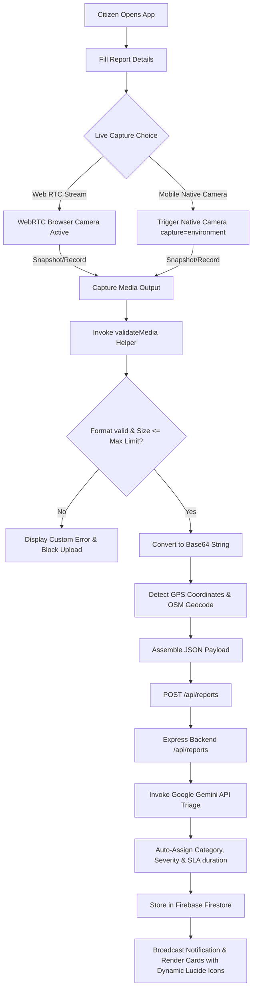
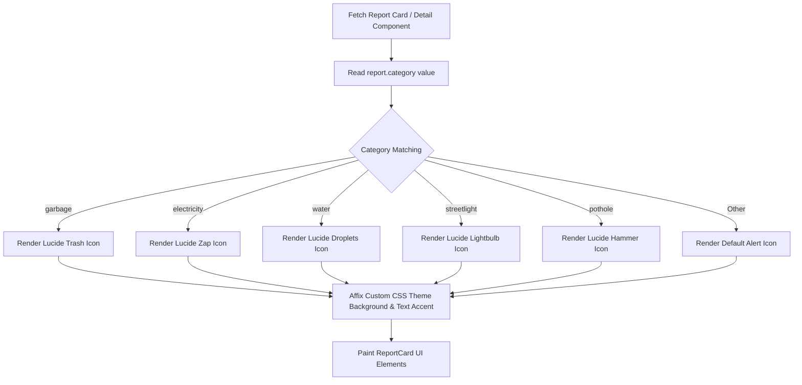
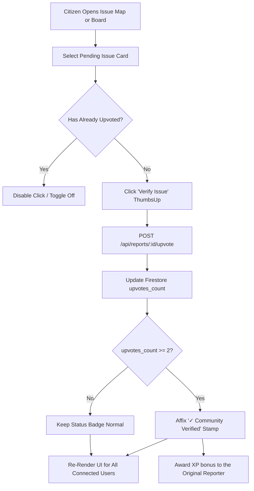
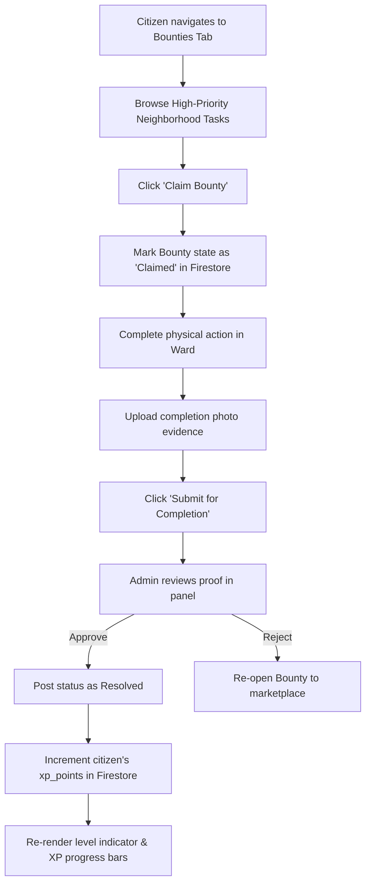
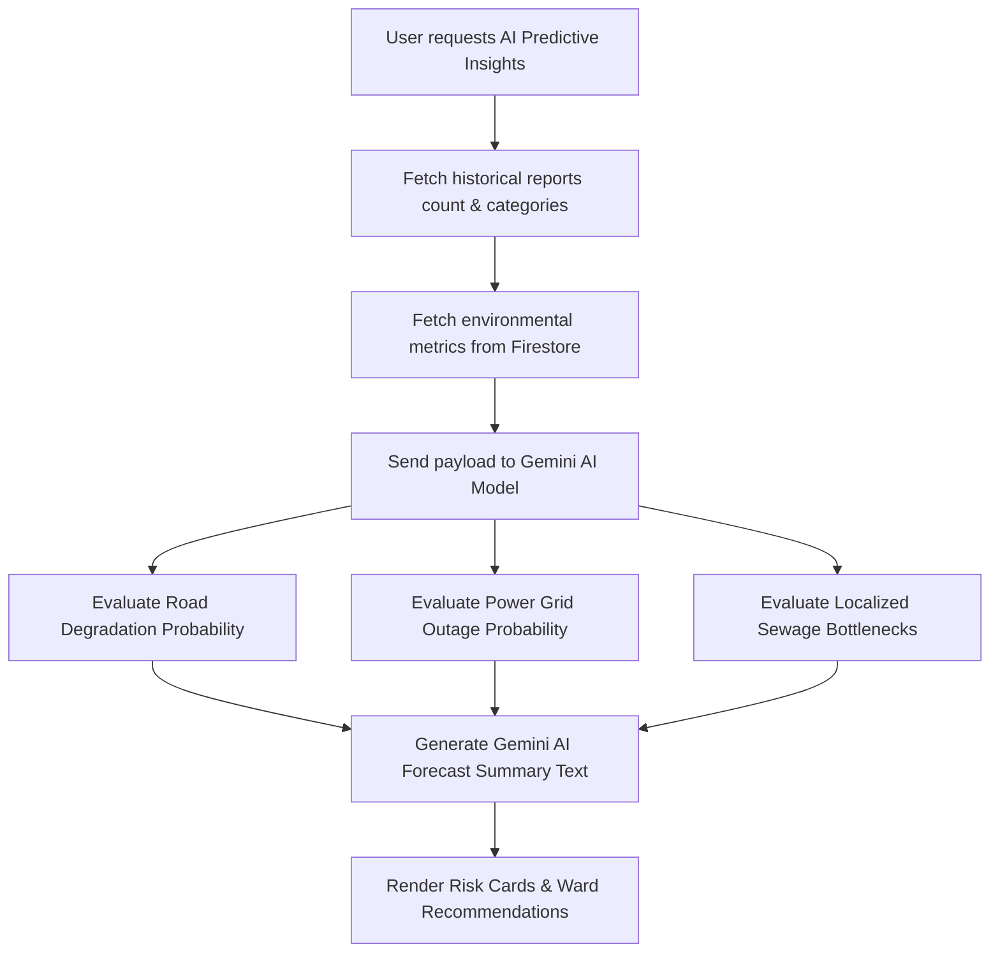

# SpotseReport 🗺️🤖

### Citizen-Powered Community Issue Reporting, AI-Smart Triage & Gamified Civic Action

SpotseReport is a full-stack civic-engagement platform that bridges the gap between citizens and public administration by automating the reporting, verification, and resolution of neighborhood issues — potholes, garbage dumps, broken streetlights, water leaks, and power outages — using Google Gemini AI, Firebase, and live browser/native media capture.

---

## 📌 Problem Statement

Municipal administrations in fast-growing cities face systemic bottlenecks in maintaining street-level infrastructure:

| ❌ Pain Point | ✅ SpotseReport's Fix |
|---|---|
| High friction in photo/video evidence submission | Live WebRTC + native mobile camera capture — no old file uploads |
| Manual, slow routing to ward engineers | Gemini AI auto-triage with SLA assignment |
| No citizen transparency or feedback loop | Gamified XP, peer verification & a real-time civic ledger |
| Purely reactive maintenance — fixes only after full failure | Predictive ML that warns of failures before they occur |
| Spam & invalid media clogging reporting portals | Strict MIME-type + size validation (10MB photo / 25MB video) |

---

## 💡 Solution

1. **Pristine reporting** — pin an exact location on an interactive Leaflet/OSM map using automatic GPS geolocation and OSM Nominatim reverse-geocoding.
2. **Live-only evidence capture** — a dedicated capture flow that accepts only real-time evidence, via a browser WebRTC camera stream or a native mobile camera trigger (`capture="environment"`).
3. **Rigorous validation** — a `validateMedia` guard enforces strict MIME types and size limits immediately after capture.
4. **Automated AI triage** — server-side Google Gemini parses each description, rewrites it in formal municipal language, extracts severity, assigns tags, and starts an SLA countdown.
5. **Community verification** — once a report earns 2+ citizen validations, it's automatically stamped **"✓ Community Verified,"** filtering spam and helping the municipality prioritize.
6. **Gamified engagement** — an XP system, the Eco-Sorter game, a Civic Trivia Quiz, and an Eco-Buddy chatbot reward long-term participation.
7. **Bounties marketplace** — high-priority cleanup tasks can be claimed, completed, and submitted for municipal verification in exchange for XP.
8. **Predictive insights** — Gemini-driven modeling analyzes historical reports, seasonal data, and issue clusters to warn ward supervisors of likely failures (e.g., "92% Road Erosion Risk in Ward 4") before they happen.

---

## 🌟 Key Features

- 🗺️ **Map-Centric Dashboard** — all reports plotted live, color-coded by status (Pending / Assigned / Resolved), with dynamic category icons (Trash, Zap, Droplets, Hammer, Lightbulb).
- 📸 **Dual-Mode Live Evidence Capture** — WebRTC browser stream + native mobile camera hook.
- 🛡️ **Fail-Safe Media Validation** — client-side MIME/size checks before Base64 encoding.
- 📍 **Automatic GPS Locator** — one-tap "Detect My Location" with reverse-geocoded address lookup.
- ✅ **Community Upvoting & Live Civic Ledger** — real-time ticker of civic activity across districts.
- 🎮 **Cleanliness Arcade** — games and quizzes that reward participation with persistent XP.
- 🏛️ **Admin Panel** — lets ward officers change report status, assign engineers, and track ward health metrics.

---

## 🛠️ Tech Stack

**Frontend**
`React 18+ (Vite)` · `TypeScript` · `Tailwind CSS` · `Motion (motion/react)` · `Lucide React`

**Backend**
`Node.js` · `Express` · `tsx` + `esbuild` (bundled to `dist/server.cjs`)

**APIs & Services**
`OpenStreetMap` + `Leaflet` · `OSM Nominatim` (reverse geocoding) · `WebRTC MediaStream API`

**Google Technologies**
`Google Gemini API` (`@google/genai`) for AI triage, the Eco-Buddy chatbot & predictive insights · `Firebase Firestore` for real-time persistence · `Firebase Authentication` for Citizen/Admin role switching · `Google Cloud Run` for serverless hosting

---

## 📊 System Architecture & Workflows

<strong>A. Issue Reporting, Live Capturing & Validation Pipeline</strong>

How a citizen fills out a report, captures live media (WebRTC or native camera), triggers the validator, and kicks off server-side Gemini triage.

<strong>B. Dynamic Icon & Category Selection Loop</strong>

How the app resolves category values into dynamic Lucide icons for instant visual recognition.

<strong>C. Community Verification & Upvoting Loop</strong>

The peer-review mechanism that upgrades a report to "Verified" status and blocks municipal spam.

<strong>D. Civic Bounties & Gamified Rewards Engine</strong>

How citizens find bounties, complete tasks, and earn persistent XP synced with Firestore.

<strong>E. AI Predictive Insights & Telemetry Forecast</strong>

How the backend and Gemini evaluate city telemetry to predict infrastructure failures.

---

## 🌍 Impact & Innovation

- **Environmental Impact** — tracks CO₂ displaced, landfill diversion, and water saved per resolved issue, converting civic action into measurable sustainability metrics.
- **Civic Engagement** — gamified XP, the bounty marketplace, and community verification turn passive citizens into active civic stakeholders.
- **Predictive Prevention** — shifts municipal maintenance from reactive to proactive by flagging road erosion, grid overloads, and drainage bottlenecks before they escalate.

---

## 📸 Screenshots

---

## 🤝 Contributing

Contributions, issues, and feature requests are welcome. Feel free to check the issues page or open a pull request.

---

## 🙌 Team

Built with ❤️ for communities everywhere.

- Your Name — Role
- Add your teammates here

---

**Powered by:** Google Gemini · Firebase · Cloud Run · React · Node.js · Leaflet/OSM

